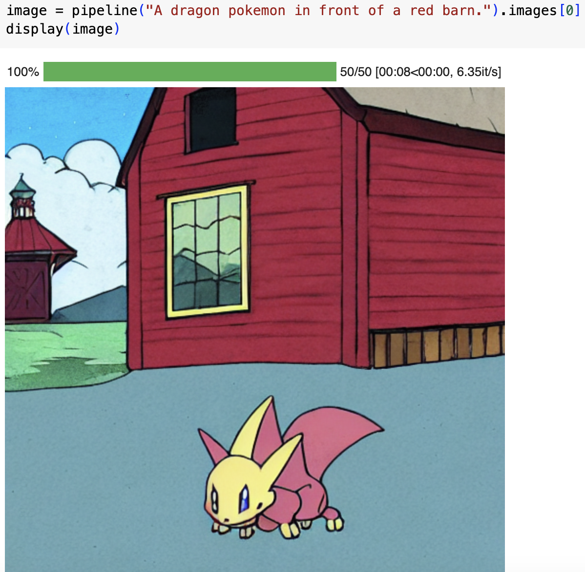

---
license: creativeml-openrail-m
base_model: runwayml/stable-diffusion-v1-5
tags:
- stable-diffusion
- stable-diffusion-diffusers
- text-to-image
- diffusers
- lora
inference: true
---
    
# LoRA text2image fine-tuning - bryant0918/pokemon-lora

You can view the finetuned hugging face model [here](https://huggingface.co/bryant0918/pokemon-lora)
These are LoRA adaption weights for runwayml/stable-diffusion-v1-5. The weights were fine-tuned on the diffusers/pokemon-gpt4-captions dataset. You can find some example images in the following. 

